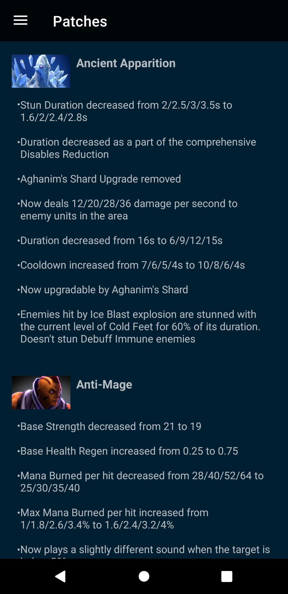

# DotaMetrics

### Description

This app allows you to view your or your friends Dota 2 stats. There are 4 categories:

- Player stats (matches, heroes, peers)
- Heroes info (attributes, abilities, talents)
- Pro teams (players, matches, heroes)
- Patchnotes

	
	&nbsp; &nbsp; &nbsp; &nbsp;
	
  &nbsp; &nbsp; &nbsp; &nbsp;
	
  &nbsp; &nbsp; &nbsp; &nbsp;
	

### Data source

All the data the application gets from the open data source [OpenDota API](https://www.opendota.com/api-keys).

### Tech stack

- Kotlin
- Retrofit
- Room + coroutines
- Paging Library
